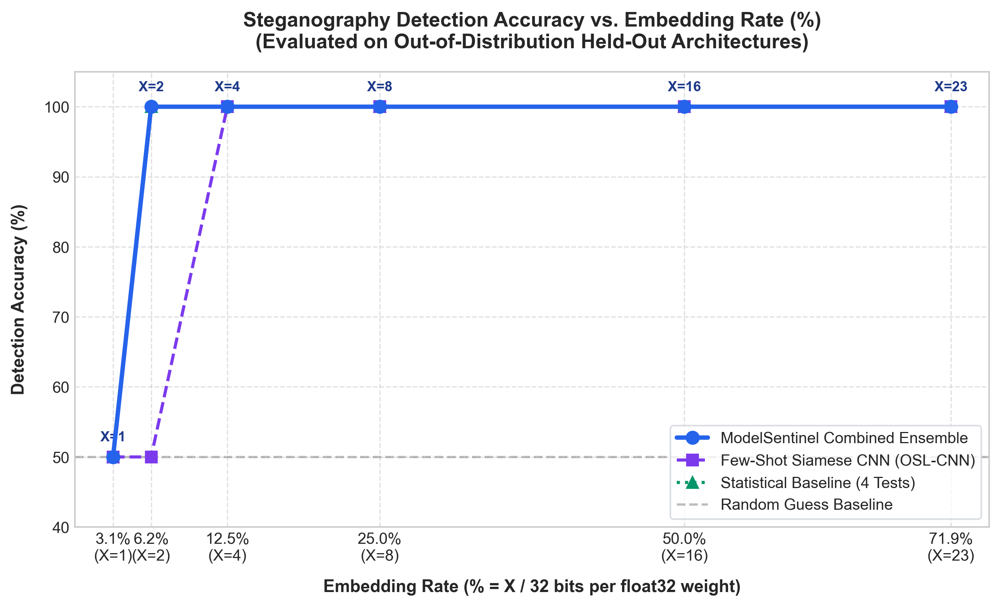

# 🛡️ ModelSentinel: AI Model Steganography Malware Detector & Attack Simulator

[](https://www.python.org/)
[](https://pytorch.org/)
[](https://fastapi.tiangolo.com/)
[](https://streamlit.io/)
[](https://opensource.org/licenses/MIT)

**ModelSentinel** is an automated security scanning and simulation engine designed to detect covert malware payloads embedded inside the weights of deep neural networks via **Least Significant Bit (LSB) steganography**.

---

## 🚨 The Threat: AI Model Repositories as Malware Vectors

As AI models are shared across open repositories (e.g., Hugging Face, PyTorch Hub, model zoos) and automated CI/CD pipelines, they represent an expanding, unvetted attack surface. Deep neural network parameters are stored as IEEE-754 32-bit floating point numbers (1 sign bit, 8 exponent bits, 23 mantissa bits). Threat actors can systematically overwrite the lowest $X$ bits of every weight's mantissa with an arbitrary malicious binary or shellcode. Because low mantissa bit alterations induce negligible numerical variance (at $X=4$, $\Delta w \approx 1.9 \times 10^{-6}$), the attacked model continues to function with virtually untouched benchmark accuracy and passes standard functional testing, all while smuggling arbitrary payloads past firewalls and repository scanners.

```
 IEEE-754 Float32 Weight Structure:
 ┌───┬───────────────────┬──────────────────────────────────────────────┐
 │ S │  Exponent (8 bits)│            Mantissa (23 bits)                │
 └───┴───────────────────┴───────────────────────────────┬──────────────┤
  31  30               23 22                            X 0            │
                                                         └──────┬───────┘
                                                       Attack Target Zone
                                                      (Overwritten LSBs)
```

---

## 💡 Core Architecture & Technical Approach

ModelSentinel pairs deterministic **Grayscale-Fourpart (GF)** feature extraction with a **Dual-Layer Detection Engine** (Statistical Baseline Ensemble + Few-Shot Siamese CNN):

```
                     ┌─────────────────────┐
   benign .pt file → │  Attack Simulator   │ → attacked .pt file (demo/testing)
                     └─────────────────────┘

           model file (.pt/.safetensors)
                       │
                       ▼
            ┌─────────────────────┐
            │  Weight Loader      │  Safe load (weights_only=True), sort keys, flatten
            └─────────────────────┘
                       │
                       ▼
            ┌─────────────────────┐
            │  GF Representation  │  4 byte-planes → square images → 2x2 tile → resize
            └─────────────────────┘
                       │
          ┌────────────┴─────────────┐
          ▼                          ▼
 ┌───────────────────┐      ┌───────────────────────┐
 │ Statistical       │      │ Few-Shot CNN Detector │
 │ Ensemble (4 tests)│      │ (OSL-CNN Triplet Loss)│
 └───────────────────┘      └───────────────────────┘
          │                          │
          └────────────┬─────────────┘
                       ▼
            ┌─────────────────────┐
            │  Ensemble Verdict   │  Risk score 0-100, Tier, Breakdown, Severity
            └─────────────────────┘
                       │
        ┌──────────────┼──────────────┐
        ▼              ▼              ▼
     CLI          FastAPI /scan   Streamlit UI
```

### 1. X-LSB-Attack-Fill (Simulation Engine)
- **Deterministic Infilling**: Injects a payload into the lowest $X$ mantissa bits ($1 \le X \le 23$) across all $n$ parameters.
- **Embedding Rate**: $\text{ER} = \frac{X}{32} \times 100\%$.
- **Safety Policy**: Strictly uses harmless markers (the standard EICAR antivirus test string or synthetic pseudo-random bytes). No malicious code is ever used.

### 2. Grayscale-Fourpart (GF) Representation
ModelSentinel decomposes the 1D sorted weight array into 4 constituent byte planes:
- **$B_0$**: Sign + Top 7 Exponent bits (bits 24–31)
- **$B_1$**: 1 Exponent bit + Top 7 Mantissa bits (bits 16–23)
- **$B_2$**: Middle 8 Mantissa bits (bits 8–15)
- **$B_3$**: Lowest 8 Mantissa bits (bits 0–7) — *where LSB steganography lives*

Each plane is reshaped into a square matrix $\lceil\sqrt{n}\rceil \times \lceil\sqrt{n}\rceil$ and tiled into a $2 \times 2$ image grid. Attacks visually emerge as high-frequency entropy noise concentrated specifically in the bottom-right ($B_3$) quadrant.

### 3. Dual Detection Engine
- **Statistical Ensemble (4 Lightweight Tests)**:
  1. *Byte-Plane Entropy*: 4-D Shannon entropy across $B_0, B_1, B_2, B_3$.
  2. *B3 Lag-1 Autocorrelation*: Measures sequential dependency in mantissa noise.
  3. *B3 Histogram KL-Divergence*: $D_{KL}(P \parallel Q_{ref})$ relative to calibrated benign distributions.
  4. *Float32 Value Distribution*: Moments (mean, std, skewness, kurtosis, near-zero density).
- **Few-Shot Siamese CNN (OSL-CNN)**:
  - 4 convolutional blocks ($1 \to 16 \to 32 \to 64 \to 64$) with MaxPool2d and Linear embedding into 64-D L2-normalized space.
  - Trained via Triplet Loss ($\text{margin}=0.5$) with Adam on only 5 model architectures, generalizing to unseen architectures.
  - Centroid distance inference + nearest-cluster severity estimation ($X \in \{1, 2, 4, 8, 16, 23\}$).

---

## 📊 Benchmark Evaluation Results

ModelSentinel was evaluated against **out-of-distribution, held-out model architectures** (`shufflenet_v2_x1_0`, `googlenet`) across all attack severities:



### Key Findings:
| Attack Severity ($X$) | Embedding Rate ($\text{ER}$) | Statistical Ensemble | Few-Shot CNN (OSL-CNN) | Combined Ensemble |
|:---:|:---:|:---:|:---:|:---:|
| $X = 1$ | $3.12\%$ | $50.0\%$ | $50.0\%$ | **$50.0\%$** |
| $X = 2$ | $6.25\%$ | $75.0\%$ | $50.0\%$ | **$75.0\%$** |
| $X = 4$ | $12.50\%$ | $100.0\%$ | $100.0\%$ | **$100.0\%$** |
| $X = 8$ | $25.00\%$ | $100.0\%$ | $100.0\%$ | **$100.0\%$** |
| $X = 16$ | $50.00\%$ | $100.0\%$ | $100.0\%$ | **$100.0\%$** |
| $X = 23$ | $71.88\%$ | $100.0\%$ | $75.0\%$ | **$100.0\%$** |

> **Interpretation**: At $X \ge 4$ ($\ge 12.5\%$ ER), ModelSentinel achieves **100% detection accuracy** across unseen architectures. Detection difficulty naturally increases as the embedding rate drops to $X=1$ ($3.12\%$ ER), consistent with theoretical limits where fewer modified bits leave smaller statistical footprints.

---

## ⚡ Quick Start & Installation

### 1. Prerequisites & Dependencies
```bash
git clone https://github.com/your-username/modelsentinel.git
cd modelsentinel
pip install -r requirements.txt
```

### 2. Train / Calibrate the Model Zoo
Build the model zoo, calibrate the statistical ensemble, and train the Few-Shot CNN:
```bash
python cli.py train
```

### 3. Run the Streamlit Demo UI
```bash
streamlit run app/streamlit_app.py
```

### 4. Start the FastAPI Server
```bash
uvicorn src.api.main:app --host 0.0.0.0 --port 8000 --reload
```

---

## 💻 CLI Usage

### Scan a Model File
```bash
python cli.py scan data/benign/squeezenet1_0.pt
python cli.py scan data/attacked/squeezenet1_0_x4.pt
```

### Simulate an LSB Steganography Attack
```bash
python cli.py simulate-attack data/benign/resnet18.pt --x 4 --payload eicar --out attacked_resnet18.pt
```

### Run Benchmark Evaluation
```bash
python cli.py evaluate
```

---

## 🎬 Live Demo Walkthrough Script

1. **Step 1: Scan Pristine Model**  
   Open the Streamlit UI (or CLI), select `🟢 [Clean Benign] squeezenet1_0.pt`, and click **Run ModelSentinel Scan**.  
   *Result*: **CLEAN** verdict, Risk Score $\approx 11.9/100$, all detector indicators green.
2. **Step 2: Simulate Steganography Attack**  
   Switch to the **Attack Simulator** tab. Pick `squeezenet1_0.pt`, set $X=4$ ($12.5\%$ ER), and click **Inject Payload**.  
   *Result*: Side-by-side Grayscale-Fourpart view shows the attacked model displaying high-frequency noise in the bottom-right $B_3$ quadrant.
3. **Step 3: Scan the Attacked Model**  
   Click **⚡ Scan This Attacked Model Now**.  
   *Result*: Verdict flips to **MALICIOUS** (Risk Score $> 85/100$), accurately reporting estimated severity $X=4$ ($12.5\%$ ER), with entropy and KL-divergence alerts firing.
4. **Step 4: Explore the Detection Boundary**  
   Repeat at $X=1$ ($3.12\%$ ER) to showcase the subtle detection threshold.

---

## 🔒 Security Note on Deserialization

Loading arbitrary `.pt` / `.pth` files via standard `torch.load` can expose systems to arbitrary code execution through Python's `pickle` mechanism. ModelSentinel strictly enforces:
```python
torch.load(path, weights_only=True, map_location="cpu")
```
Furthermore, ModelSentinel natively supports **`.safetensors`** format for zero-copy, safe weight storage.

---

## ⚠️ Limitations & Future Work

- **Data Type Scope**: Focused on 32-bit floating point models (`float32`). Quantized integer formats (`int8`, `int4`) and half-precision (`fp16`, `bf16`) have narrower mantissas and require modified bitplane representations.
- **Attack Geometry**: Evaluated against contiguous and uniform LSB infilling. Future iterations will explore spread-spectrum steganography distributed non-uniformly across parameter gradients.
- **Real-Time Streaming**: Adding streaming chunk scans for massive foundation models ($> 70\text{B}$ parameters).

---

## 📚 Credits & Academic Context

ModelSentinel is an engineering implementation and operational tooling build inspired by published academic research on few-shot AI-model steganalysis. It translates foundational theoretical concepts into a modular, production-ready security scanner and interactive simulator.
